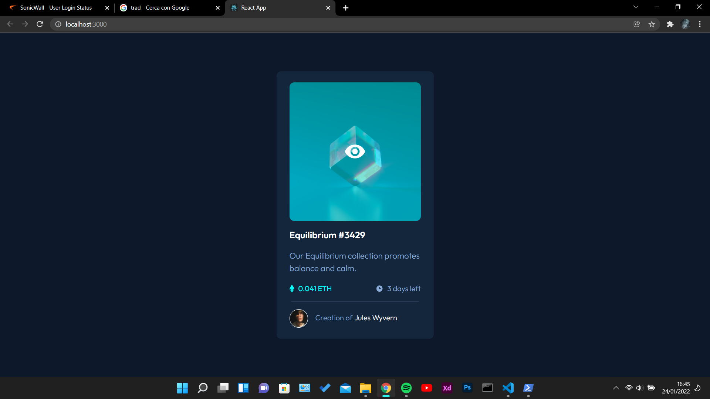

# Frontend Mentor - NFT preview card component solution

This is a solution to the [NFT preview card component challenge on Frontend Mentor](https://www.frontendmentor.io/challenges/nft-preview-card-component-SbdUL_w0U). Frontend Mentor challenges help you improve your coding skills by building realistic projects.

## Table of contents

- [Overview](#overview)
  - [The challenge](#the-challenge)
  - [Screenshot](#screenshot)
  - [Links](#links)
- [My process](#my-process)
  - [Built with](#built-with)
  - [What I learned](#what-i-learned)
  - [Continued development](#continued-development)
  - [Useful resources](#useful-resources)
- [Author](#author)
- [Acknowledgments](#acknowledgments)

## Overview

### The challenge

Users should be able to:

- View the optimal layout depending on their device's screen size
- See hover states for interactive elements

### Screenshot



### Links

- Solution URL: [Add solution URL here](https://your-solution-url.com)
- Live Site URL: [Add live site URL here](https://your-live-site-url.com)

## My process

### Built with

- CSS custom properties
- Mobile-first workflow
- [React](https://reactjs.org/) - JS library
- [Typescript](https://www.typescriptlang.org/) - JS superset using with React
- [Bootsrap](https://getbootstrap.com/) - CSS framework
- [Styled Components](https://styled-components.com/) - For styles

### What I learned

```css
.proud-of-this-css {
  transition: box-shadow 1s;
}
```

```Tsx
const Card = (): JSX.Element => {

onMouseEnter={()=> setVisible(true)}
onMouseLeave={()=> setVisible(false)}
}
```

### Continued development

Hooks

## Author

- Website - [Add your name here](https://www.your-site.com)
- Frontend Mentor - [@Marcus-Giglio](https://www.frontendmentor.io/profile/Marcus-Giglio)
- Linkedin - [Marcus Giglio](https://www.linkedin.com/in/marcus-g-514b51175/)
